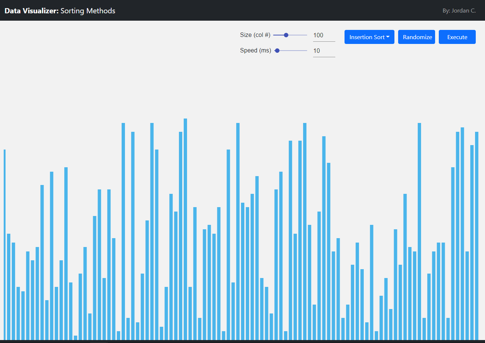
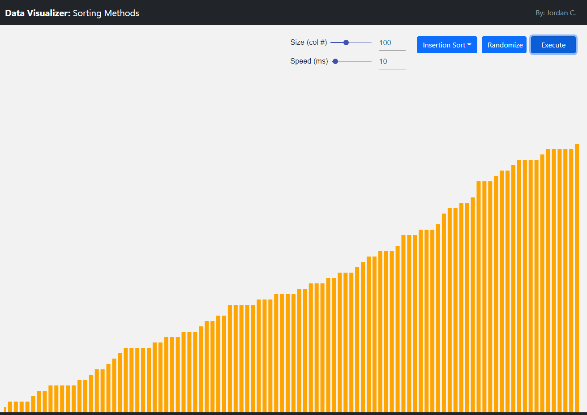

## Description
A React.js project created to showcase my component-based creation and data visualization skills by showing how different kinds of sorting methods operate throughout each iteration.  

Utilizes the following libraries:
- React Bootstrap
- Material UI
- React Charts

## Installation
- clone repository.
- cd into project root.
- run 'npm install'.
- run 'npm start'.
Note: latest of version of Node.js and Node Package Manager will be required to run this program.  

## Results
<b>Start:</b>

  

<b>End:</b>

  

<b>Video Demonstration:</b>

